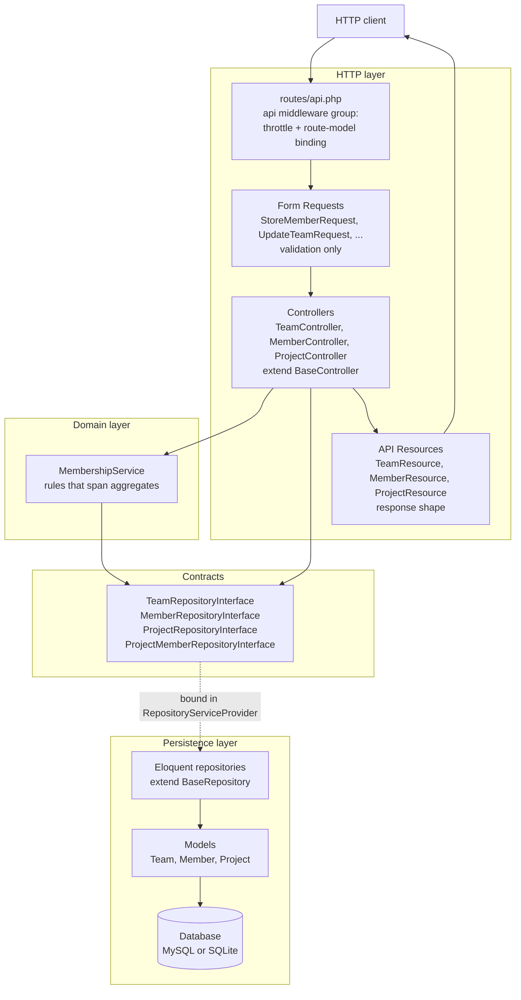
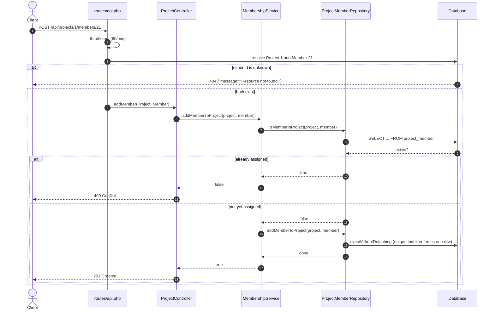

# Sprintfwd Teams API

A small Laravel JSON API for tracking teams, the members who belong to them, and
the projects those members work on. A member belongs to exactly one team and can
be assigned to any number of projects.

This is a take-home exercise, so it stays deliberately narrow: three resources,
a handful of relationship endpoints, and no features beyond what the brief asks
for. The interesting parts are the layering, the schema, and the test suite.

---

## Captured output

There is no user interface beyond a route index at `/`, so the evidence here is
real request/response traffic rather than screenshots. The full transcript -
thirteen exchanges captured against a seeded instance - lives in
[`docs/api-transcript.txt`](docs/api-transcript.txt), and the test and linter
output in [`docs/test-run.txt`](docs/test-run.txt). The excerpts below are
copied from that file verbatim.

Listing teams, paginated and rate limited:

```
$ curl -s -i -X GET 'http://127.0.0.1:8780/api/teams?per_page=2' -H 'Accept: application/json'
HTTP/1.1 200 OK
Content-Type: application/json
X-RateLimit-Limit: 60
X-RateLimit-Remaining: 59

{
    "data": [
        {
            "id": 1,
            "name": "Batz-O'Conner",
            "created_at": "2026-09-25T12:08:03+00:00",
            "updated_at": "2026-09-25T12:08:03+00:00"
        },
        {
            "id": 2,
            "name": "Gleason PLC",
            "created_at": "2026-09-25T12:08:03+00:00",
            "updated_at": "2026-09-25T12:08:03+00:00"
        }
    ],
    "links": {
        "first": "http://127.0.0.1:8780/api/teams?page=1",
        "last": "http://127.0.0.1:8780/api/teams?page=2",
        "prev": null,
        "next": "http://127.0.0.1:8780/api/teams?page=2"
    },
    "meta": {
        "current_page": 1,
        "from": 1,
        "last_page": 2,
        "links": [ ... 4 page links elided; see docs/api-transcript.txt ... ],
        "path": "http://127.0.0.1:8780/api/teams",
        "per_page": 2,
        "to": 2,
        "total": 4
    }
}
```

Validation is rejected at the edge rather than surfacing as a driver error:

```
$ curl -s -i -X POST 'http://127.0.0.1:8780/api/members' -H 'Accept: application/json' -H 'Content-Type: application/json' -d '{"first_name":"Ada","last_name":"Lovelace","team_id":424242}'
HTTP/1.1 422 Unprocessable Content
Content-Type: application/json
X-RateLimit-Limit: 60
X-RateLimit-Remaining: 55

{
    "message": "The selected team id is invalid.",
    "errors": {
        "team_id": [
            "The selected team id is invalid."
        ]
    }
}
```

Assigning a member to a project is idempotent at the API boundary - the second
attempt is a `409`, and the database is left with exactly one pivot row:

```
$ curl -s -i -X POST 'http://127.0.0.1:8780/api/projects/1/members/21' -H 'Accept: application/json'
HTTP/1.1 201 Created
Content-Type: application/json
X-RateLimit-Limit: 60
X-RateLimit-Remaining: 52

{
    "message": "Member added to project."
}

$ curl -s -i -X POST 'http://127.0.0.1:8780/api/projects/1/members/21' -H 'Accept: application/json'
HTTP/1.1 409 Conflict
Content-Type: application/json
X-RateLimit-Limit: 60
X-RateLimit-Remaining: 51

{
    "message": "Member is already assigned to this project."
}

$ sqlite3 database/database.sqlite \
    "SELECT project_id, member_id, COUNT(*) AS rows FROM project_member
     WHERE project_id = 1 AND member_id = 21 GROUP BY project_id, member_id;"

project_id=1  member_id=21  rows=1
```

---

## Architecture

Requests flow inward through four layers, and every arrow points at an
abstraction rather than a concrete class: controllers depend on the repository
*interfaces*, never on Eloquent.



**The pattern is a repository layer behind interfaces, with a thin domain
service for cross-aggregate rules.** Controllers translate HTTP to method calls
and back; they hold no business logic. `MembershipService` owns the two
decisions that touch more than one aggregate — whether a member is already on a
project, and moving a member between teams.

`BaseController` and `BaseRepository` are both abstract. `store` and `update`
are deliberately *not* on `BaseController`: each resource validates through its
own Form Request, and PHP will not let a subclass narrow an inherited
`Request` parameter, so keeping them per-controller stays explicit.

---

## Request flow

Assigning a member to a project touches every layer, so it makes the clearest
sequence:



---

## Quickstart

Requires PHP 8.1+ and Composer. SQLite is the default, so no database server is
needed.

```bash
composer install
cp .env.example .env
php artisan key:generate
touch database/database.sqlite
php artisan migrate --seed
php artisan serve
```

The API is then at `http://127.0.0.1:8000/api/teams`, and `/` lists every route.

With Docker instead (see [Limitations](#limitations) — this has been authored
but not yet built):

```bash
cp .env.example .env && php artisan key:generate
DB_PASSWORD=choose-one docker compose up --build
# API on http://localhost:8780
```

---

## Configuration

Copy `.env.example` to `.env`. Everything has a working default except
`APP_KEY`.

| Variable | Required | Default | Purpose |
| --- | --- | --- | --- |
| `APP_NAME` | no | `Sprintfwd Teams API` | Shown on the route index at `/`. |
| `APP_ENV` | no | `local` | `local`, `testing` or `production`. Outside production, Eloquent throws on lazy loading and on silently discarded attributes. |
| `APP_KEY` | **yes** | — | Encryption key. Generate with `php artisan key:generate`; the app will not boot without it. |
| `APP_DEBUG` | no | `true` | Set `false` in production so stack traces are not returned to clients. |
| `APP_TIMEZONE` | no | `UTC` | Application timezone. Leave as UTC; all timestamps are serialised as ISO-8601 with an explicit offset. |
| `APP_URL` | no | `http://localhost:8000` | Base URL used to build pagination links. |
| `DB_CONNECTION` | no | `sqlite` | `sqlite` or `mysql`. |
| `DB_DATABASE` | no | `database/database.sqlite` (absolute) | For SQLite, leave **unset** so the absolute `database_path()` default is used — a relative path breaks under `php artisan serve`, whose worker runs from a different working directory. For MySQL, the schema name. |
| `DB_HOST` | mysql only | `127.0.0.1` | MySQL host. |
| `DB_PORT` | mysql only | `3306` | MySQL port. |
| `DB_USERNAME` | mysql only | `forge` | MySQL user. |
| `DB_PASSWORD` | mysql only | empty | MySQL password. Required by `docker-compose.yml`, which refuses to start without it. |
| `LOG_CHANNEL` | no | `stack` | Use `stderr` in a container. |
| `LOG_LEVEL` | no | `debug` | Minimum level written. |
| `CACHE_DRIVER` | no | `file` | Cache store. `array` under test. |
| `QUEUE_CONNECTION` | no | `sync` | Nothing is queued today; see [Design notes](#design-notes). |
| `SESSION_DRIVER` | no | `file` | Only the `/` route uses a session; the API is stateless. |
| `APP_SEED` | no | `false` | Docker only: set `true` to run the seeder on container start. |

---

## Development

```bash
composer test          # php artisan test
composer lint          # vendor/bin/pint --test
composer lint:fix      # vendor/bin/pint
```

Tests run against an in-memory SQLite database configured in `phpunit.xml`, so
they need no database server and leave nothing behind. `tests/Feature` drives
the real container end to end — routes, Form Requests, repositories, Eloquent
and the schema — with nothing mocked, so a regression anywhere in that stack
fails a test. `tests/Unit` covers `MembershipService`'s decision logic in
isolation.

Formatting is [Laravel Pint](https://laravel.com/docs/pint) with the `laravel`
preset plus a few rules pinned in `pint.json` (sorted imports, single quotes,
trailing commas, no unused imports).

---

## Project structure

```
app/
  Http/
    Controllers/        BaseController + one per resource; HTTP translation only
    Requests/           Form Requests; all validation lives here
    Resources/          JSON shape for Team, Member and Project
  Interfaces/           Repository contracts that controllers depend on
  Repositories/         Eloquent implementations of those contracts
  Services/             MembershipService: rules spanning more than one aggregate
  Models/               Team, Member, Project
  Providers/
    RepositoryServiceProvider.php   Binds each interface to its implementation
    AppServiceProvider.php          Strict Eloquent guards outside production
database/
  migrations/           teams, members, projects, project_member
  factories/            Model factories used by tests and the seeder
  seeders/              DatabaseSeeder: 4 teams, 20 members, 3 staffed projects
docs/
  api-transcript.txt    Captured request/response pairs
  test-run.txt          Captured test and linter output
routes/
  api.php               Every application endpoint
  web.php               The route index at /
tests/
  Feature/              End-to-end tests through the real container
  Unit/                 MembershipService in isolation
```

### Routes

| Method | Path | Purpose |
| --- | --- | --- |
| `GET` | `/api/teams` | List teams, paginated |
| `POST` | `/api/teams` | Create a team |
| `GET` | `/api/teams/{team}` | Show a team |
| `PUT`/`PATCH` | `/api/teams/{team}` | Update a team |
| `DELETE` | `/api/teams/{team}` | Delete a team |
| `GET` | `/api/teams/{team}/members` | Members of a team, paginated |
| `GET` | `/api/members` | List members, paginated, each with its team |
| `POST` | `/api/members` | Create a member |
| `GET` | `/api/members/{member}` | Show a member |
| `PUT`/`PATCH` | `/api/members/{member}` | Update a member |
| `DELETE` | `/api/members/{member}` | Delete a member |
| `PATCH` | `/api/members/{member}/team` | Move a member to another team |
| `GET` | `/api/projects` | List projects, paginated |
| `POST` | `/api/projects` | Create a project |
| `GET` | `/api/projects/{project}` | Show a project |
| `PUT`/`PATCH` | `/api/projects/{project}` | Update a project |
| `DELETE` | `/api/projects/{project}` | Delete a project |
| `GET` | `/api/projects/{project}/members` | Members assigned to a project |
| `POST` | `/api/projects/{project}/members/{member}` | Assign a member to a project |

---

## Design notes

**The API belongs in `routes/api.php`.** The endpoints originally lived in
`routes/web.php` under a manual `api` prefix, which put a JSON API inside the
`web` middleware group: session cookies, `ShareErrorsFromSession`, and CSRF
verification on every write. It also meant the `api` rate limiter defined in
`RouteServiceProvider` was never applied, because nothing ran in the group it
belongs to. Moving the routes makes the API stateless and throttled — the
`X-RateLimit-*` headers in `docs/api-transcript.txt` are the proof — and enables
route-model binding, which is what turns an unknown id into a clean 404 instead
of a 500.

**Every list is paginated and capped.** `BaseRepository::paginate()` replaced an
unbounded `Model::all()`. `per_page` is clamped to 100 in `BaseController`, so
`?per_page=1000000` cannot be used to pull an entire table into memory; there is
a test for exactly that.

**The real bottleneck was the schema, not the query volume.** This dataset is
small, so the honest scalability work here is indexing and correctness rather
than caching or queues:

- `members` carried a composite index on `(id, team_id)`. Led by the primary
  key, that index can never serve "members of team X", which is the hottest
  query in the application. It is now a plain index on `team_id`, created by
  `foreignId()->constrained()`.
- The pivot table was created as `projects_members` while both models declared
  `project_member`, so every pivot query failed at runtime. The table is now
  `project_member`, with foreign keys to both sides and a `unique(project_id,
  member_id)` constraint, so a duplicate assignment is impossible even if two
  requests race past the application-level check.
- `MemberRepository::paginate()` eager loads `team`. Without it a page of 15
  members would either omit the team entirely or, if the serialiser touched the
  relation directly, issue one query per row.

**Lazy loading is an error outside production.** `AppServiceProvider` enables
`Model::preventLazyLoading()` and `preventSilentlyDiscardingAttributes()`, so
an accidental N+1 or a mass-assignment typo fails loudly in development and in
the test suite instead of shipping quietly.

**Responses go through API Resources.** Controllers never return a model
directly, so the wire format is a deliberate choice rather than whatever
happens to be in `$fillable` on the day. `whenLoaded()` keeps a relation out of
the payload unless it was explicitly eager loaded.

**Errors are JSON under `/api`.** The exception handler renders
`ModelNotFoundException` and `NotFoundHttpException` as JSON for any request
matching `api/*`, so a client that forgets an `Accept` header still gets JSON
rather than Laravel's HTML error page.

**Nothing is queued, and nothing is cached.** Every operation here is a single
short transaction; adding a queue or a cache layer would be ceremony rather than
engineering. The seam for it exists — repositories are behind interfaces, so a
caching decorator is a new class and one line in `RepositoryServiceProvider`.

**Extensibility seam.** The one seam a future developer actually needs is the
repository contract. Swapping the storage engine, adding read-through caching,
or pointing a resource at a different service means writing a new implementation
of `TeamRepositoryInterface` and rebinding it — no controller, Form Request or
test changes.

---

## Limitations

- **There is no authentication or authorisation.** The exercise defines no users
  and no roles, so every endpoint is open to any caller. Adding an auth system
  would be inventing requirements; the rate limiter is the only protection in
  place. Before this were deployed anywhere public it would need
  `auth:sanctum` on the route group and a policy per resource.
- **The Docker image has been authored but never built.** `Dockerfile`,
  `docker-compose.yml` and `.dockerignore` are written to a multi-stage,
  non-root, healthchecked standard and `docker compose config` parses cleanly,
  but no `docker build` or `docker compose up` has been run against them. Treat
  them as unverified.
- **The container serves via `php artisan serve`.** That is fine for review and
  wrong for production, which would want php-fpm behind nginx.
- **Dependencies are pinned to Laravel 10, which is end of life.** `composer
  audit` reports 48 advisories across 14 packages, and current Composer refuses
  to resolve `laravel/framework ^10.10` at all because every 10.x release has an
  open advisory. Upgrading to a supported major is the right fix and is a
  deliberate non-goal here, because rewriting the bootstrap and middleware
  layout of a take-home would obscure the work being reviewed.
- **No soft deletes and no audit trail.** Deleting a project removes its
  membership rows outright.
- **Pagination is offset-based.** Fine at this size; a large table would want
  cursor pagination, which Laravel supports on the same query builder.
- **`personal_access_tokens` and `password_reset_tokens` migrations are stock
  Laravel scaffolding** left in place. Nothing uses them — there is no `User`
  model in this application.
