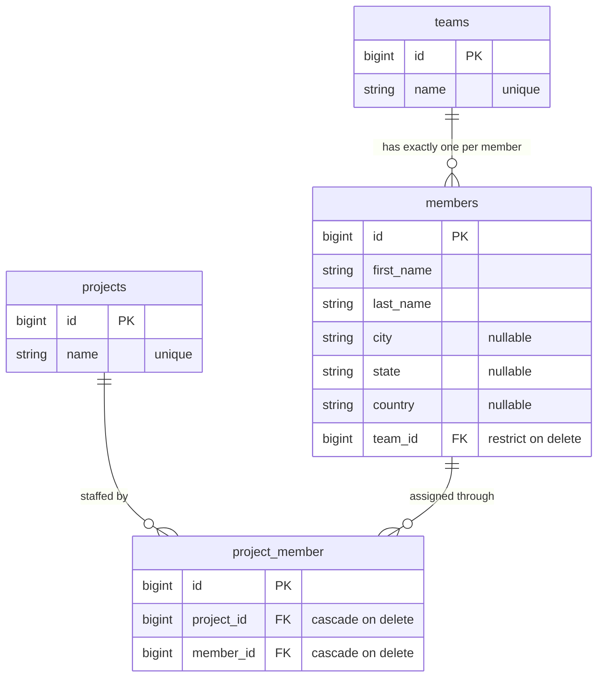
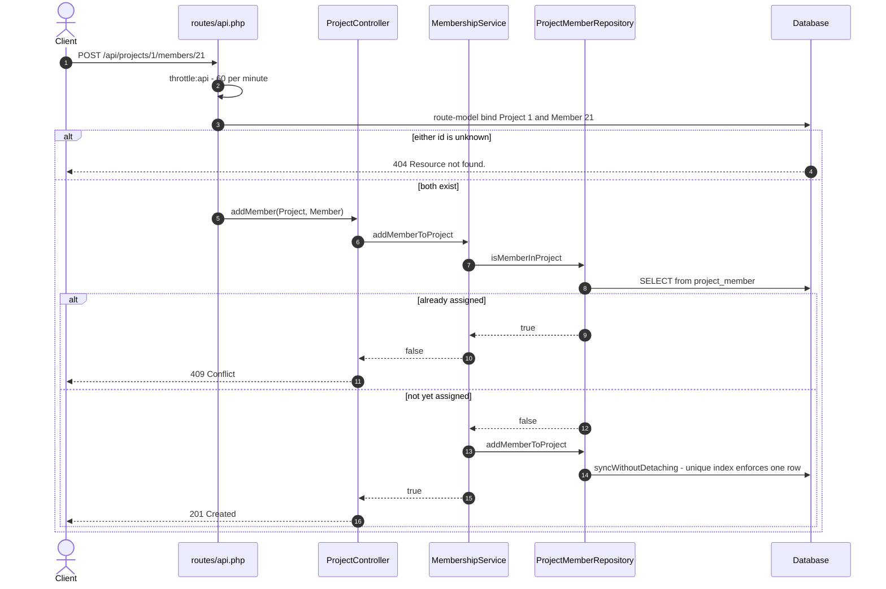

# Sprintfwd Teams API

A Laravel 10 JSON API for teams, the members who belong to them, and the projects
those members are staffed onto. A member belongs to exactly one team (`team_id` is
not nullable) and may be assigned to any number of projects.

The name is accurate: this is the SprintFwd take-home exercise and the subject
really is teams, members and projects. It stays a modelling and layering exercise
rather than a product — three resources, four relationship endpoints, no auth, no
users. `app/`, `database/` and `tests/` are the work. The rest is stock skeleton.

## The data model

Four tables. The pivot is where the correctness lives.



Three schema decisions worth naming:

- **`unique(project_id, member_id)`** on the pivot. The application checks for a
  duplicate before writing, but the constraint is what makes a second row
  impossible when two requests race past that check. A test asserts the constraint
  directly: *`ProjectMembershipTest::the schema refuses a duplicate membership row`*.
- **The pivot FKs are `cascadeOnDelete`**, so deleting a project takes its
  membership rows with it and leaves the members alone —
  *`ProjectApiTest::deleting a project removes its membership rows`*.
  `members.team_id` is `restrictOnDelete` instead, so a team with members cannot be
  deleted. That one is enforced by the schema but not covered by a test.
- **`team_id` carries its own index**, created by `foreignId()->constrained()`.
  "List the members of team X" is the hottest query here and filters on `team_id`
  alone, so it needs an index led by that column.

## Run it

PHP 8.1+ and Composer. SQLite is the default, so no database server is needed.

```bash
composer install
cp .env.example .env
php artisan key:generate
touch database/database.sqlite
php artisan migrate --seed
php artisan serve
```

The seeder builds 4 teams, 5 members in each, and 3 projects each staffed with 6
of those 20 members. `http://127.0.0.1:8000/api/teams` is then live, and `/`
serves a hand-written index of the main endpoints.

```bash
composer test          # php artisan test
composer lint          # vendor/bin/pint --test
```

## Endpoints

Nineteen routes, all under `/api` and all in the `api` middleware group: stateless,
rate limited to 60 per minute per IP, route-model binding on the relationship paths.

| Method | Path | Notes |
| --- | --- | --- |
| `GET` | `/api/teams` | paginated, `per_page` clamped to 100 |
| `POST` | `/api/teams` | name required and unique |
| `GET` `PUT`/`PATCH` `DELETE` | `/api/teams/{team}` | update ignores the team's own name when checking uniqueness |
| `GET` | `/api/teams/{team}/members` | paginated, 404 on an unknown team rather than an empty page |
| `GET` | `/api/members` | paginated, each row eager loads its team |
| `POST` | `/api/members` | `team_id` must exist |
| `GET` `PUT`/`PATCH` `DELETE` | `/api/members/{member}` | |
| `PATCH` | `/api/members/{member}/team` | move a member to another team |
| `GET` | `/api/projects` | paginated |
| `POST` | `/api/projects` | name required and unique |
| `GET` `PUT`/`PATCH` `DELETE` | `/api/projects/{project}` | |
| `GET` | `/api/projects/{project}/members` | only that project's members |
| `POST` | `/api/projects/{project}/members/{member}` | assign a member — see below |

Validation lives in seven Form Requests, so a bad payload is a `422` with a field
map rather than a driver error, and every response goes through an API Resource, so
the wire format is a choice rather than whatever is in `$fillable` today. Under
`/api` the handler renders `ModelNotFoundException` and `NotFoundHttpException` as
JSON even when the client forgot an `Accept` header.

## Assigning a member to a project

This is the only endpoint that is not CRUD, and it is the one that touches every
layer. It is idempotent at the boundary: the second attempt is a `409` and the
database still holds exactly one row.



Captured against a seeded instance, verbatim from
[`docs/api-transcript.txt`](docs/api-transcript.txt):

```
$ curl -s -i -X POST 'http://127.0.0.1:8780/api/projects/1/members/21' -H 'Accept: application/json'
HTTP/1.1 201 Created
X-RateLimit-Remaining: 52

{
    "message": "Member added to project."
}

$ curl -s -i -X POST 'http://127.0.0.1:8780/api/projects/1/members/21' -H 'Accept: application/json'
HTTP/1.1 409 Conflict
X-RateLimit-Remaining: 51

{
    "message": "Member is already assigned to this project."
}

$ sqlite3 database/database.sqlite \
    "SELECT project_id, member_id, COUNT(*) AS rows FROM project_member
     WHERE project_id = 1 AND member_id = 21 GROUP BY project_id, member_id;"

project_id=1  member_id=21  rows=1
```

There is no UI here beyond that route index, so the evidence on disk is traffic
rather than screenshots: twelve request/response pairs and two direct database
queries in that transcript, plus the test and linter output in
[`docs/test-run.txt`](docs/test-run.txt).

## How the code is arranged

```
app/Http/Controllers/    BaseController plus one per resource. HTTP translation only.
app/Http/Requests/       Seven Form Requests. All validation.
app/Http/Resources/      JSON shape for Team, Member, Project.
app/Interfaces/          The contracts controllers and the service depend on.
app/Repositories/        Eloquent implementations, bound in RepositoryServiceProvider.
app/Services/            MembershipService: the two rules that span aggregates.
app/Models/              Team, Member, Project.
```

Controllers depend on the repository *interfaces*, never on Eloquent, and hold no
business logic. `store`/`update` are deliberately *not* on the abstract
`BaseController`: each resource validates through its own Form Request, and PHP
will not let a subclass narrow an inherited `Request` parameter.

`AppServiceProvider` turns on `preventLazyLoading()` and
`preventSilentlyDiscardingAttributes()` outside production, so an accidental N+1
or a mass-assignment typo throws in development and under test instead of shipping
quietly.

Nothing is queued or cached — every operation is one short transaction. The seam is
the repository contract: read-through caching or a different storage engine is a new
class and one line in `RepositoryServiceProvider`, touching no controller or test.

## Tests

```
Tests:    39 passed (135 assertions)
PASS   .......................................................... 86 files
```

`tests/Feature` (35 tests, four files) drives the real container end to end —
routes, Form Requests, repositories, Eloquent, the schema — with **nothing
mocked**, so a regression anywhere in that stack fails a test. `tests/Unit` covers
`MembershipService`'s branching in isolation. Everything runs against in-memory
SQLite configured in `phpunit.xml`: no database server, nothing left behind.

One test is worth singling out. `MemberApiTest::listing members includes each team
in a bounded number of queries` asserts both that every row carries its team *and*
the query bound. Asserting only the query count would pass even with the eager load
removed, because `whenLoaded()` omits the key rather than lazy-loading it.

## Known gaps

- **No authentication or authorisation.** The exercise defines no users and no
  roles, so every endpoint is open and the rate limiter is the only protection.
  Adding an auth system would be inventing requirements. Going public would mean
  `auth:sanctum` on the route group and a policy per resource.
- **Dependencies are pinned to Laravel 10, which is end of life.** `composer
  audit` reports 48 advisories across 14 packages, `laravel/framework` among them,
  and Composer now refuses to resolve `laravel/framework ^10.10` at all because
  every 10.x release has an open advisory. `composer install` from the committed
  lock still works. Moving to a supported major is the right fix and a deliberate
  non-goal here: it rewrites the bootstrap and middleware layout and would bury
  the work being reviewed.
- **The Docker files have never been built or booted.** `Dockerfile`,
  `docker-compose.yml`, `.dockerignore` and `docker/entrypoint.sh` are multi-stage,
  non-root and healthchecked, and `docker compose config` parses (and refuses to
  start with `DB_PASSWORD` unset), but no `docker build` and no `docker compose up`
  has been run against them. Treat them as unverified. The container would also
  serve via `php artisan serve`, fine for review and wrong for production.
- **Tests run on SQLite while the MySQL config is the production target.**
  Standard Laravel practice, but the unique-constraint and cascade behaviours
  asserted above are not verified against MySQL.
- **Offset pagination**, no soft deletes, no audit trail. Fine at this size.
- **`personal_access_tokens` and `password_reset_tokens` migrations are stock
  scaffolding** left in place. Nothing uses them — there is no `User` model.
